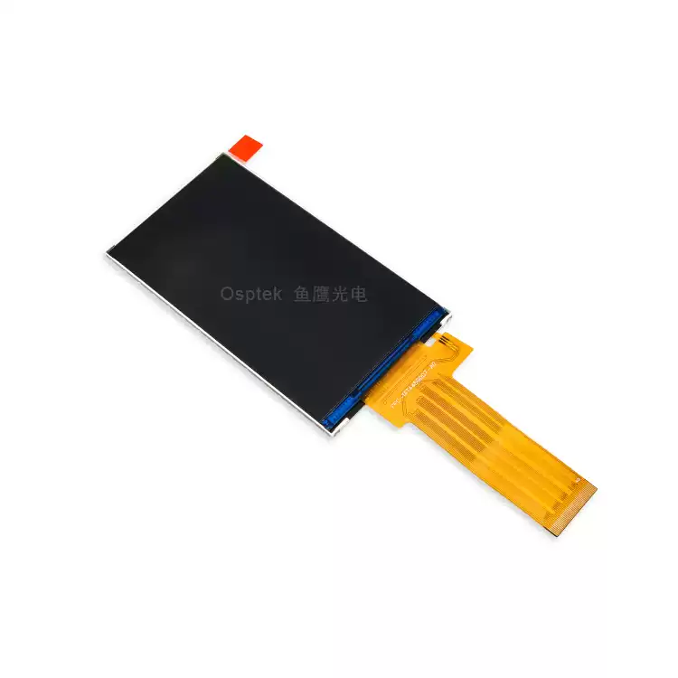

<p align="left"></p>

<h1 align="center">OSPTEK 4.45″ TFT 480×854（ST7701S · MIPI）</h1>

<p align="center"><b>TFT · MIPI · ST7701S</b></p>

<p align="center"><a href="./README_EN.md">English</a> | 简体中文 · <a href="../../README.md">规格族索引</a></p>

<p align="center">
  
  
  
  
</p>

<p align="center"></p>

## 目录

- [产品简介](#产品简介)
- [规格参数](#规格参数)
- [仓库结构](#仓库结构)
- [相关资料](#相关资料)
- [购买链接](#购买链接)
- [技术支持](#技术支持)

---

## 产品简介

OSPTEK **4.45 寸 480×854 TFT** 是一款 **MIPI** 接口彩色显示模组，驱动为 **ST7701S**。适合手持终端、仪表与竖屏 HMI 等场景。

规格标识（仓库名）：`tft-4.45-480x854-mipi-st7701`

当前模组版本：**YDP445B003-V1**。电气与外形细节以 [`docs/YDP445B003-V1.pdf`](./docs/YDP445B003-V1.pdf) 为准。

## 规格参数

| 项目 | 规格 |
| ---- | ---- |
| 尺寸 | 4.45 英寸 |
| 类型 | TFT / IPS（彩色，常黑） |
| 分辨率 | 480×854 |
| 接口 | MIPI |
| 驱动 IC | ST7701S |

> 完整外形尺寸、FPC 定义、供电与时序以产品规格书 / 外形图为准。

## 仓库结构

```text
tft-4.45-480x854-mipi-st7701/                                # 仓库根（导航见 ../../README.md）
└── versions/
    └── YDP445B003-V1/                                # 本料号完整资料
        ├── README.md
        ├── README_EN.md
        ├── images/
        ├── docs/
        └── examples/
```

## 相关资料

### 本产品资料

| 资料 | 链接 |
| ---- | ---- |
| 产品规格书（YDP445B003-V1） | [`docs/YDP445B003-V1.pdf`](./docs/YDP445B003-V1.pdf) |
| 初始化序列（INI） | [`docs/BOE4.45IPS-PV044WVQ-N80-3QP1_FW_V1.1_gamma1.9-2dot.INI`](./docs/BOE4.45IPS-PV044WVQ-N80-3QP1_FW_V1.1_gamma1.9-2dot.INI) |

## 购买链接

<p align="center">
  <a href="https://shop110742373.taobao.com/"></a>
  &nbsp;&nbsp;
  <a href="https://www.aliexpress.com/store/1105701619"></a>
</p>

**国内（淘宝）**

- 店铺：[鱼鹰光电工厂店](https://shop110742373.taobao.com/)

**海外（AliExpress）**

- 店铺：[OSPTEK Official Store](https://www.aliexpress.com/store/1105701619)

## 技术支持

- 技术支持 / 产品咨询：<luyu@osptek.com>
- QQ 技术交流群：**985881096**
- 公司官网：<https://osptek.com/>
- 有任何问题，都可以在本仓库 Issues 中提问

---

<p align="center"><sub>© 2026 OSPTEK 鱼鹰光电 · 本仓库资料采用 CC BY 4.0 许可</sub></p>
